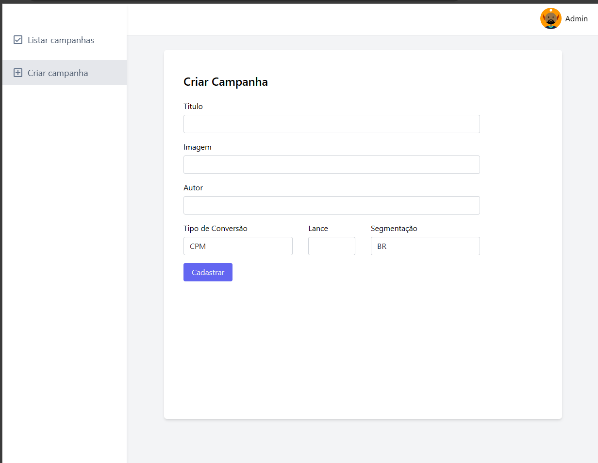

# revmob-front

<h2  align="center">

</h2>

FRONTEND for campaign registration and display of the best campaign


```bash
Link BACKEND: 
https://github.com/sararchh/revmob-back
```

## 🧪 Tecnologias

O projeto foi desenvolvido usando as seguintes tecnologias:
  

- [ReactJS](https://reactjs.org/docs/forms.html)
- [Yup](https://www.npmjs.com/package/yup)
- [TailwindCss](https://tailwindcss.com/)
- [TypeScript](https://www.typescriptlang.org/)

## How to run for development

1. Clone this repository
2. Install all dependencies

```bash
npm i
```

3. To run in development
```bash
npm run start
```

